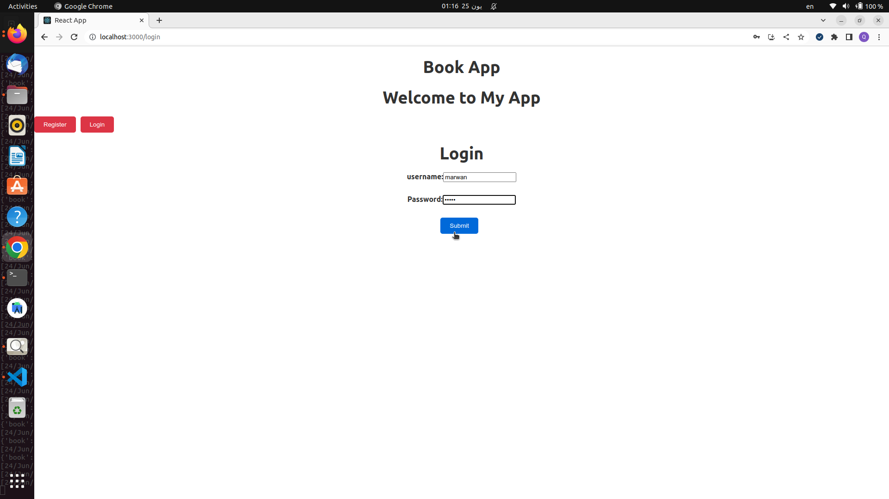

# BookStore

This is a React application that allows authors to view, create, update, and delete books and reader to just view the content of books. The application communicates with a backend API running on http://localhost:8000 using the Axios library. The API requires authentication with JWT tokens passed in the Authorization header.

This project is a SPA (single-page application) with multiple routes. It includes login and register forms that allow users to create an account or sign in to an existing one. The routes are implemented using the React Router library.

Also, This project follows responsive design principles by using responsive design libraries, such as Material UI.

## Install and Running
 
 1. Clone the repository to your local machine using the command:
 `git clone https://github.com/marwan-kotb/bookstore-react.git`

 2. Install the dependencies using the command:
 `npm install`

 3. Start the application using the command:
 `npm start`

This will start the application and open it at http://localhost:3000.

## Usage

The home page (by default) is for a reader whereas the user can't make any action without login except view content of books

1. To use the application as an author, you need to register a user account or login with an existing one. Click on the "Register" or "Login" button in the navigation bar and fill in the required details.
 
2. After logging in, you will be redirected to the home page where you can view all the books in the system. You can click on any book to view its details or click on the "Pages Of This Book" link to view the pages of the book.

3. To create a new book, click on the "Create new book" button and fill in the required details in the form.

4. To update a book's details, click on the "MakeUpdate" button next to the book's details. This will open a form where you can edit the book's title and description.

5. To delete a book, click on the "Delete" button next to the book's details.

Note: You can only perform create, update, and delete operations if you are logged in and have a valid JWT token in your Authorization header.

6. You can also make a CRUD operations with an pages of books

7. To log out, click on the "Logout" button in the navigation bar.

## ScreenShots

Here are some screenshots of the application running:

- Home page  
# 

- Pages of one of books
# 

- Login 
# 

- After logged in
# 

- Update book
# 

- After updating
# 

- Delete one of books
# 
# 

- Go to pages of one of books
# 
# 

- Update page
# 
# 

- Create new page in a book
# 
# 

- logged out and register
# 
# 

